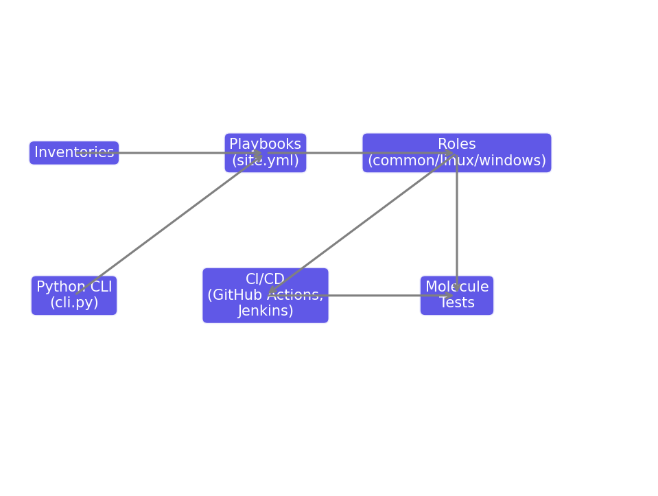

# Architecture

The flow of RunOps:
- Inventories provide hosts and vars
- Playbooks (site.yml) apply roles
- Roles run tasks (common, linux, windows)
- Molecule tests verify roles
- CI/CD integrates automation pipelines
